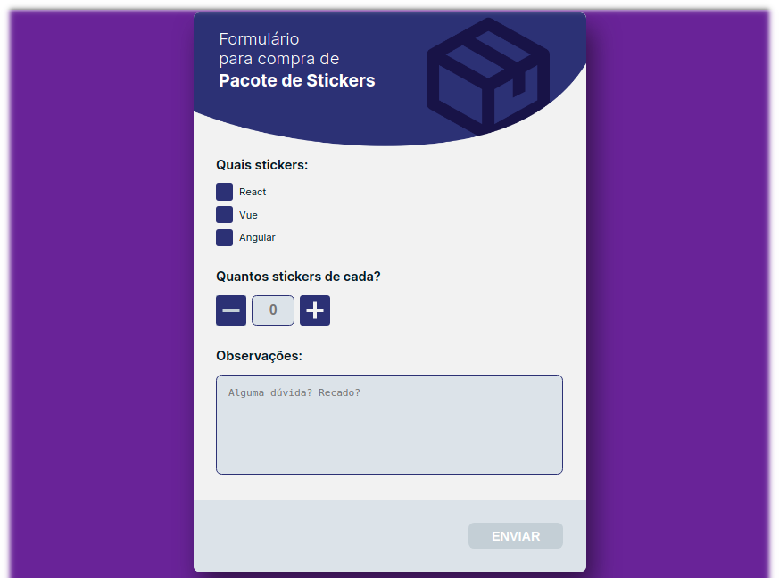

# Teste VagasCom
Nesse projeto construí um desafio de front-end realizado pela VAGAScom, você pode acessá-lo [aqui](https://github.com/VAGAScom/desafio-front-end). Nele foi pedido para refatorar um código HTML, deixando-o mais semântico, além de fazer as implementações pedidas com JavaScript.
 **Para saber mais sobre o desenvolvimento do projeto e minha experiência com ele veja meu post no linkedin** [aqui](link)!
 **Teste o código no projeto já hospedado:** [marcoskloss-teste-vagascom.netlify.app](https://marcoskloss-teste-vagascom.netlify.app/)

### Preview

## Tecologias utilizadas
 - HTML
 - CSS
 - JavaScript
